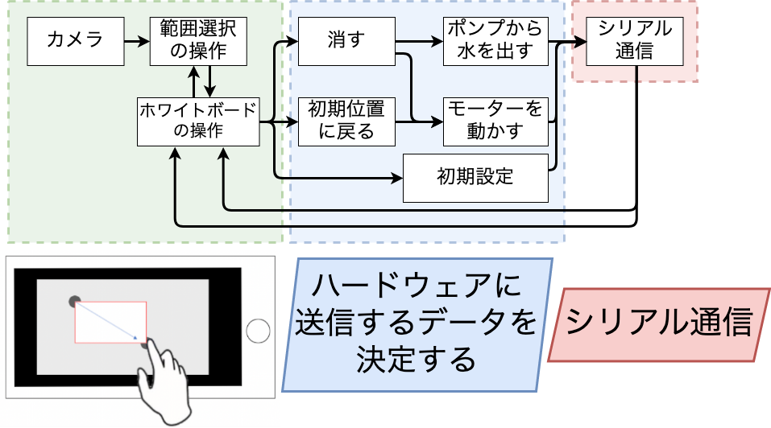

# 自動ホワイトボード消しの実用化に向けた改良

## 2022/10/31 第2版発行

---

# 目次

1. はじめに
   
   1. 概要
   
   2. 開発環境
   
   3. システムの概要

2. コンポーネント
   
   1. Camera
   
   2. Image
   
   3. 

# 1.はじめに

## 1.概要

我々はRTミドルウェアを用いて、ホワイトボードの文字を自動で消すシステムを開発している。本稿では、本システムの改善について述べる。昨年のシステムとの相違点は主に三点ある。一つ目は、材質を木材からアルミニウムに変更することで歪みを解消し、スムーズな可動と軽量化を図ったことである。二つ目は消したい領域をより細かく指定可能にすることで、本来消すべきではない部分を消してしまうことを防げるようになったことである。三つ目は水が入ったタンクを設置し、自動で白板を濡らすことができるようになったため、雑巾を取り外して濡らす必要がなくなったことである。

自動ホワイトボード消しのイメージ

## 2.開発環境

本コンポーネント群の開発環境を以下に示す。

| OS       | Windows10                                 |
| -------- | ----------------------------------------- |
| RTミドルウェア | OpenRTM-aist-2.0.0-RELESE(Python 版)       |
| 開発環境     | VSCode                                    |
| Python   | 3.8.5                                     |
| 必要モジュール  | math, numpy, cv2, PIL, sys, time, tkinter |

## 3.システムの概要

このシステムは、ユーザーの指定した範囲もしくは、全範囲(全部消す)をレールや枠組みに沿って本体が移動し自動でホワイトボードに書かれたものを消すものである。

そして、制御部分にはRTミドルウェアを用いており、Cameraコンポーネントを用いて取得したホワイトボードの動画(画像)をSelectコンポーネントで消す範囲を選択し、Eraseコンポーネントでどのように移動するか決定することでMoveコンポーネントが移動するためのコマンドを生成し、Serialコンポーネントを用いてハードウェアに移動するデータをもちいて実際に動かす。というものである。

以下の2つのコンポーネント図を示す。

1.詳しく説明してあるコンポーネント図

2.簡潔化しまとまりごとに色分けしたコンポーネント図

# # 2.コンポーネント

## 1.Camera

カメラから取得した画像を出力するコンポーネント。

- **InPort**

- **OutPort**
  
  | **名称** | **データ型**         | **説明**            |
  | ------ | ---------------- | ----------------- |
  | image  | RTC::CameraImage | カメラから取得した画像を出力する。 |

- Configuration
  
  | 名称          | データ型  | 説明                   | 初期値 | 制限      |
  | ----------- | ----- | -------------------- | --- | ------- |
  | CameraIndex | short | 使用するカメラのインデックスを設定する。 | 0   | 0<=x<=5 |

## 2.Image

コンフィギュレーションで指定されたパスの画像をポートから出力するコンポーネント。

デバックする際、Cameraコンポーネントの代わりに使用することを想定している。

- **InPort**

- **OutPort**
  
  | 名称    | データ型             | 説明                           |
  | ----- | ---------------- | ---------------------------- |
  | Image | RTC::CameraImage | コンフィギュレーションで指定されたパスの画像を出力する。 |

- **Configuration**
  
  | 名称   | データ型   | 説明        | 初期値          | 制限        |
  | ---- | ------ | --------- | ------------ | --------- |
  | Path | string | 出力する画像のパス | Emprt String | Undefined |

## 3.Select

範囲選択をし、選択した矩形の座標を出力するコンポーネント.

- **InPort**
  
  | 名称            | データ型        | 説明          |
  | ------------- | ----------- | ----------- |
  | ShowImage     | CameraImage | 選択する際の背景の画像 |
  | CompeteMotion | TimedString | 終了した動作名     |
  | StatusCode    | TimedUShort | ステータスコード    |

- **OutPort**
  
  | 名称       | データ型              | 説明         |
  | -------- | ----------------- | ---------- |
  | StartPos | RTC::TimedPoint2D | 指定された範囲の始点 |
  | EndPos   | RTC::TimedPoint2D | 指定された範囲の終点 |

- **Configuration**
  
  | 名称     | データ型 | 説明         | 初期値 | 制限           |
  | ------ | ---- | ---------- | --- | ------------ |
  | Width  | int  | 選択ウィンドウの横幅 | 800 | 400<=x<=1600 |
  | Height | int  | 選択ウィンドウの高さ | 450 | 225<=x<=900  |

## 4.Erase

選択された範囲を元に消すためのパスを決定するコンポーネント。

- **InPort**
  
  | 名称       | データ型              | 説明         |
  | -------- | ----------------- | ---------- |
  | StartPos | RTC::TimedPoint2D | 指定された範囲の始点 |
  | EndPos   | RTC::TimedPoint2D | 指定された範囲の終点 |

- **OutPort**
  
  | 名称       | データ型           | 説明                         |
  | -------- | -------------- | -------------------------- |
  | MovePath | TimedStringSeq | **x:y**の形式で移動する座標のデータを出力する |
  
  

- **Configuration**
  
  | 名称  | データ型 | 説明  | 初期値 | 制限  |
  | --- | ---- | --- | --- | --- |
  |     |      |     |     |     |

## 5.MoveInitial

初期位置(左上)に本体を移動させるコンポーネント。

移動しきったかの検出にはリミットスイッチを用いる。

- **InPort**
  
  | 名称  | データ型 | 説明  |
  | --- | ---- | --- |

- **OutPort**
  
  | 名称  | データ型 | 説明  |
  | --- | ---- | --- |

- **Configuration**
  
  | 名称  | データ型 | 説明  | 初期値 | 制限  |
  | --- | ---- | --- | --- | --- |
  |     |      |     |     |     |

## 6.InitialSetting

本体のサイズ、ホワイトボードの横幅をリミットスイッチを用いて検出するコンポーネント。

単位はステッピングモーターの回転数。

- **InPort**
  
  | 名称  | データ型 | 説明  |
  | --- | ---- | --- |

- **OutPort**
  
  | 名称  | データ型 | 説明  |
  | --- | ---- | --- |

- **Configuration**
  
  | 名称  | データ型 | 説明  | 初期値 | 制限  |
  | --- | ---- | --- | --- | --- |
  |     |      |     |     |     |

## 7.Pump

指定された量の水をポンプから出すコンポーネント。

単位はmL

- **InPort**
  
  | 名称     | データ型             | 説明         |
  | ------ | ---------------- | ---------- |
  | Amount | RTC::TimedUShort | ポンプから出す水の量 |

- **OutPort**
  
  | 名称      | データ型             | 説明               |
  | ------- | ---------------- | ---------------- |
  | Command | RTC::TimedString | ポンプから水を出すためのコマンド |

- **Configuration**
  
  | 名称  | データ型 | 説明  | 初期値 | 制限  |
  | --- | ---- | --- | --- | --- |
  |     |      |     |     |     |

## 8.Move

パスを元に、モーターを動かすためのコマンドを生成するコンポーネント。

- **InPort**
  
  | 名称      | データ型              | 説明            |
  | ------- | ----------------- | ------------- |
  | Command | RTC::TimedPoint2D | モーターを動かすための座標 |

- **OutPort**
  
  | 名称      | データ型             | 説明              |
  | ------- | ---------------- | --------------- |
  | Command | RTC::TimedString | ハードウェアに送信するコマンド |

- **Configuration**
  
  | 名称  | データ型 | 説明  | 初期値 | 制限  |
  | --- | ---- | --- | --- | --- |
  |     |      |     |     |     |

## 9.Serial

シリアル通信のRead/Writeを行うコンポーネント。

- **InPort**
  
  | 名称    | データ型             | 説明             |
  | ----- | ---------------- | -------------- |
  | Write | RTC::TimedString | シリアル通信で書き込むデータ |

- **OutPort**
  
  | 名称   | データ型             | 説明              |
  | ---- | ---------------- | --------------- |
  | Read | RTC::TimedString | シリアル通信で読み込んだデータ |

- **Configuration**
  
  | 名称        | データ型   | 説明               | 初期値         | 制限        |
  | --------- | ------ | ---------------- | ----------- | --------- |
  | Path      | string | シリアル通信を行うデバイスのパス | EmptyString |           |
  | Boundrate | int    | シリアル通信を行うための速度   | 9600        | Undefined |